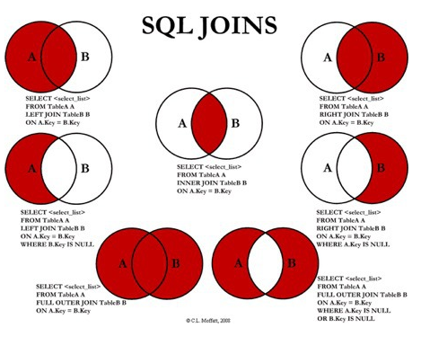

# JOIN

-  DB 내의 여러 테이블의 레코드를 조합하여 하나의 결과 집합으로 만드는 것 
- INNER JOIN , OUTER JOIN
- OUTER JOIN 의 경우 LEFT , RIGHT , FULL 로 있다 . 
- FULL OUTER JOIN은 DBMS 에서만 지원 

INNER JOIN 과 OUTER JOIN 의 차이점 

- INNER JOIN 의 경우 교집합으로 JOIN 대상이 되는 컬럼에서 A/B 양쪽 다 있는 경우 

-  OUTER JOIN 의 경우는 각 종류에 따라 그 결과물이 조금씩 달라짐 
  - LEFT :  A 의 모든 열과 B에 있는 공통 부분을 얻게 되고 A 에  있지만  B에는 없는 내용의 경우 우측은 NULL 처리 
  - RIGHT : B의 모든 열과 A에 있는 공통 부분을 얻게 되고 B에 있지만 A에는없는 내용의 경우 좌측은 NULL로 처리 
  - FULL :  A와 B 의 합집합

