# 정규화 

 데이터 논리 구조로 표현하는 관계 스키마 설계에는 몇 가지 원칙이 있습니다.  

필요한 속성(Attribute), 개체(Entity), 관계성(Relationship)을 식별하여 릴레이션을 구성하고 

불필요한 데이터의 중복이 발생하지 않도록 해야 하며, 

속성 사이의 관계성과 데이터의 종속성을 고려해서 설계해야 합니다. 

또한 효율적인 데이터 처리와 일관성 유지 방법 등도 고려해서 설계해야 하는 원칙이 있습니다.

**정규화(Normalization)란 하나의 릴레이션에 하나의 의미만 존재할 수 있도록 릴레이션을 분해해 나가는 과정**이라 할 수 있습니다. 정규화의 목적은 구성되는 모든 릴레이션이 중복되지 않게 효과적으로 데이터베이스 내에 표현이 가능하도록 하는 것이며 삽입, 삭제, 갱신 시 Anomaly 현상이 발생하지 않도록 하는 것입니다.

### 이유

**정규화를 함으로써 얻게 되는 효과는 자료의 저장 공간을 최소화하고 자료 불일치를 최소화하며 자료 구조를 안정화 시킴은 물론 이상( Anomaly) 현상을 방지하는 효과**를 볼 수 있습니다.

## 이상 현상 

이상 현상은 **갱신 이상(Modification Anomaly), 삽입 이상(Insertion Anomaly), 삭제 이상(Deletion Anomaly)**으로 구성된다. 

 

결론 ) 이상 현상이란? 테이블내의 **데이터 중복성에 의해서 발생되는 데이터 불일치 현상**이다.

 

갱신 이상 (Modification Anomaly) : 반복된 데이터 중에 일부를 갱신 할 시 데이터의 불일치가 발생한다.

삽입 이상 (Insertion Anomaly) : 불필요한 정보를 함께 저장하지 않고서는 어떤 정보를 저장하는 것이 불가능하다.

삭제 이상 (Deletion Anomaly) : 필요한 정보를 함께 삭제하지 않고서는 어떤 정보를 삭제하는 것이 불가능하다.

> 이상 현상은 정규화(Normalization)을 통해 방지할 수 있다.

- 이상 현상 예시 

#### 갱신 이상

어떤 값을 업데이트 했을때 그 속성의 다른 속성값들과의 불일치가 발생하는 현상

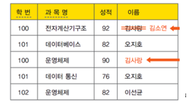

위와 같이 첫번째 튜플의 이름 = 김사랑을 김소연으로 고치게 될 경우 3번째 튜플의 내용과 불일치가 발생한다.

이것이 발생되지 않게 하려면 김사랑 값을 갖는 모든 튜플을 일일이 다 찾아서 수정해야한다.

 

#### 삽입 이상

내가 원하는 값만 테이블에 삽입하고 싶은데, 테이블에 필요하지 않은 필드들 때문에 원치 않는 필드의 값도 삽입해야 하는 경우

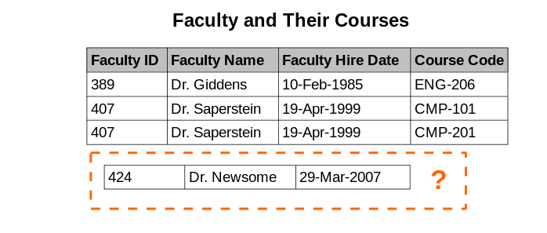

나는 1,2,3번 필드에 대한 값만 테이블에 넣고 싶은데,

테이블이 4개의 필드로 구성되어 있기 때문에 마지막 **필드 값을 무엇으로 해야할지 결정 못하는 것**이

삽입 이상이다.

#### 삭제 이상

내가 원하는 값만 테이블에서 삭제하고 싶은데, 하나의 튜플이 삭제를 원하지 않는 속성값도 갖고 있기 때문에 같이 지워져서 발생하는 문제

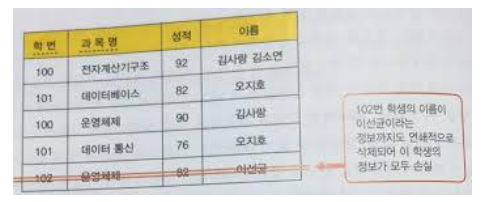

운영체제 성적 82라는 정보만 삭제하려고한다.

근데 테이블이 더 많은 수의 필드로 구성되어 있기 때문에 이것을 지우려면

**지우고 싶지 않은 필드들의 정보도 같이 지워야한다**.

이것이 삭제 현상이다.

## 정규화 과정 

정규화 과정은 제1정규형으로부터 제5 정규형까지의 과정이 있습니다.

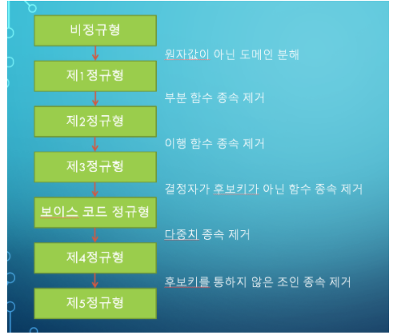

비정규형은 하나의 튜플에서 속성을 입력되는 도메인 값으로 여러 개의 값이 들어와서 원자성(Atomic)을 가지지 못한 경우

제1 정규형(First Normal Form : 1NF)

**제1 정규형 과정을 통해 원자값이 아닌 도메인을 분해하여 어떤 릴레이션 R에 속한 모든 도메인이 원자값으로만 되어 있도록 설계합니다.**

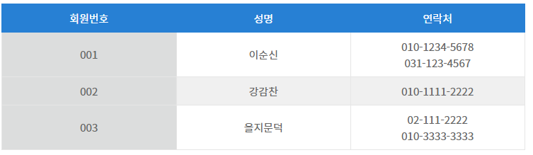

위 표를 살펴보면 연락처가 집전화번호와 휴대폰 번호로 되어 있는데 하나의 튜플에서 모든 도메인 값이 하나의 원자값만 가질 수 있도록 제1 정규형 과정을 거치면 아래와 같이 재구성

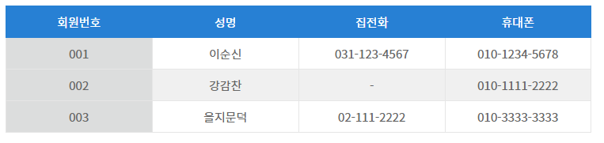

 

**제2 정규형(Second Normal Form : 2NF)**

어떤 릴레이션 R이 제1정규화에 속하고 기본키에 속하지 않는 모든 속성이 키본키에 완전 함수적 종속이면 충족하는 정규화

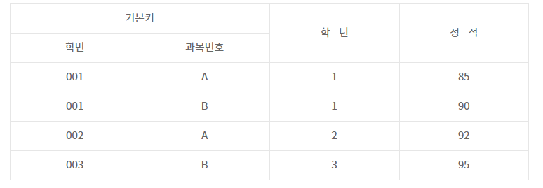

성적 속성은 복합 속성(학번, 과목 번호)으로 이루어진 기본 키에 완전 함수적 종속 관계를 이루어 키에 대해 만족할 만한 종속 관계를 유지하고 있지만 학년 속성은 기본 키의 구성 속성인 학번에만 부분적으로 종속 관계를 이루고 있기 때문에 아래와 같이 2개의 릴레이션으로 분해하여 기본키에 속하지 않는 모든 속성이 기본 키에 완전 함수적 종속 상태가 되도록 해야 합니다.

성적(학번, 과목 번호, 성적) => 기본키 : {학번, 과목 번호}, 외래키 : {학번}

학년(학번, 학년) => 기본키 : 학번

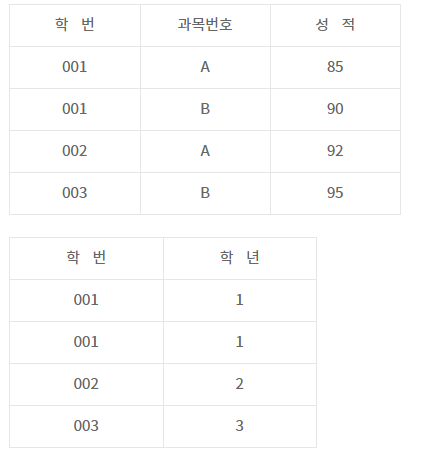

**제3 정규형(Third Normal Form : 3NF)**

어떤 릴레이션 R이 제2정규화에 있으며 기본키에 속하지 않는 모든 속성이 기본키에 이행적 함수 종속이 아닌 상태의 관계

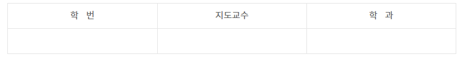

위와 같은 릴레이션이 있을 때 학과는 학번에 함수적 종속 관계를 형성하고 있으면서 지도교수를 통해 이행적 함수 종속이 되고 있습니다. 즉, 학생이 지도교수가 소속될 학과를 선택한 것이 아니라 학생이 지도교수를 선택하면 지도교수는 자신이 소속될 학과를 선택함으로써 학생이 지도교수가 소속될 학과를 선택한 것처럼 보입니다. 따라서 이행적 함수 종속을 제거하여 제3 정규형으로 릴레이션을 분해하면 아래와 같습니다.

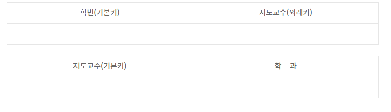

**보이스 코드 정규형(Boyce-Codd Normal Form : BCNF)**

릴레이션 R의 모든 결정자가 후보키이면 릴레이션 R은 Boyce-Codd 정규형에 속하는 상태를 말합니다.

비결정자에 의한 함수 종속 관계를 해결하는 것으로 모든 속성이 모든 후보키에 대해 만족할 만한 함수 종속 관계를 유지시키는 것을 말합니다. 

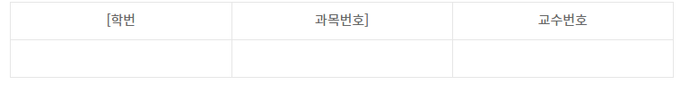

학생이 어떤 교수가 강의하는 과목을 수강하였는지를 나타내는 수강신청 릴레이션에서 기본키를 [학번, 과목 번호]로 정의하고 교수 번호 속성으로 구성하였을 때 [학번, 과목 번호] -> 교수 번호가 성립하고 교수 또한 여러 과목을 가르칠 수 있으므로 교수 번호 -> 과목 번호도 성립하게 됩니다. 이를 함수 종속 다이어그램으로 나타내면 아래와 같습니다.

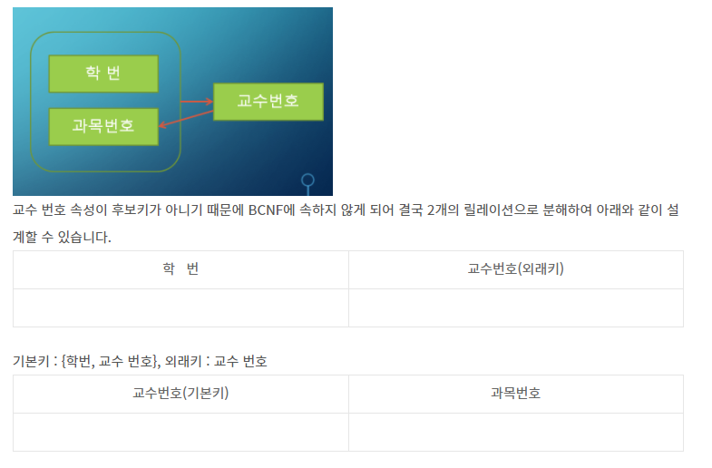

기본키 : 교수 번호

 **BCNF 정규형에 속하는 릴레이션은 모두 제3 정규형에 속하지만 역으로는 성립되지 않는다는 점도 기억해 두어야 할 중요한 포인트**입니다.

**제 4정규형 Four Normal Form : 4NF)** 

릴레이션 R에 다중치 종속(Multi Value Dependency : MVD) A ->>B가 존재할 때 R의 모든 속성도 A에 함수 종속이면 릴레이션 R은 제4 정규형에 속합니다

R에 A, B, C  세 개의 속성이 속해 있을 때 속성(A, C)의 도메인 값에 대응되는 B의 도메인 값 집합이 C 값에 독립이면, B는 A에 다중치 종속이라 하고 기호로는 A ->>B로 표시합니다.

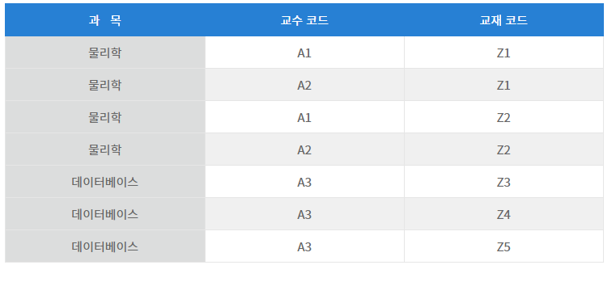

위 강의 릴레이션에서 물리학 과목의 담당 교수는 A1, A2이고 교재 코드가 Z1, Z2라면 [강의 릴레이션]에는 4개의 튜플이 포함되어야 합니다. 이렇게 릴레이션이 구성되면 많은 데이터의 중복이 초래되고 이상현상이 발생합니다.

따라서 **[강의 릴레이션]에서는 MVD 과목 ->> 교수코드|교재코드가 존재하므로 두 개의 릴레이션 과목 교수(과목, 교수 코드)와 과목 교재(과목, 교재 코드)로 아래와 같이 무손실 분해**를 할 수 있습니다.

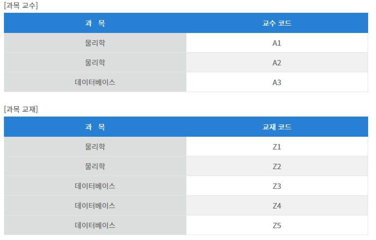

위에서 함수 종속이란 용어를 사용했는데 **함수 종속(FD : Functional Dependency)은 좋은 릴레이션 설계를 위한 정형적 기준으로 속성의 의미와 속성 상호 간의 관계에서 유도되는 일종의 제약 조건을 말합니다.**

참고로 함수 종속의 정의는 어떤 릴레이션 R에서 A, B가 릴레이션 R의 부분 속성(Attribute)이라고 할 때 속성 A의 도메인 값(속성 값, 원자 값) 각각에 대해 시간에 관계없이 속성 B의 도메인 값이 오직 한 개만 연관된다면 B는 A의 함수 종속이라 하고, A -> B로 표기합니다. 여기서 A는 결정자, B는 종속자라고 합니다.

ㄴ

**제5 정규형(Five Normal Form : 5NF)**

릴레이션 R에 존재하는 모든 조인 종속(JD)이 릴레이션 R의 후보키를 통해서만 성립된다면 릴레이션 R은 제5 정규형 또는 PJ/NF(Projection-Join Normal Form)에 속합니다.

예를 들어 {A, B, C}를 릴레이션 R의 부분집합이라고 할 때, 릴레이션 R에서 {A, B, C}를 프로젝션한 것들을 조인한 것과 원래의 릴레이션 R이 같다면 릴레이션 R은 조인 종속(JD : Join Dependency)을 만족시킬 수 있습니다.

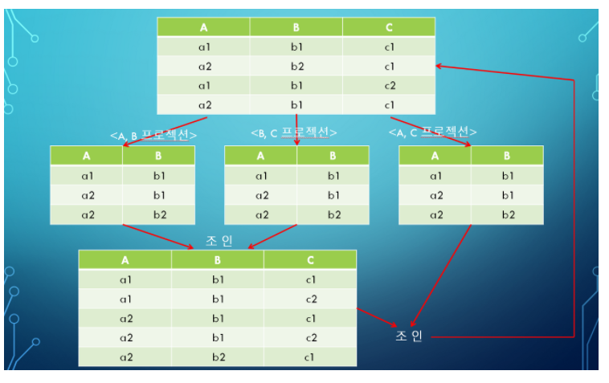

위에서 프로젝션이란 속성을 구하는 연산으로 수직적 부분 집합을 취하는 연산을 말하고 조인이란 2개 이상의 릴레이션을 조건에 따라 접속하는 연산을 말합니다.

레퍼런스 

https://minimax95.tistory.com/entry/%EC%A0%95%EA%B7%9C%ED%99%94Normalization-%EA%B0%9C%EB%85%90%EA%B3%BC-%EC%A0%95%EA%B7%9C%ED%99%94-%EA%B3%BC%EC%A0%954NF-5NF?category=305607